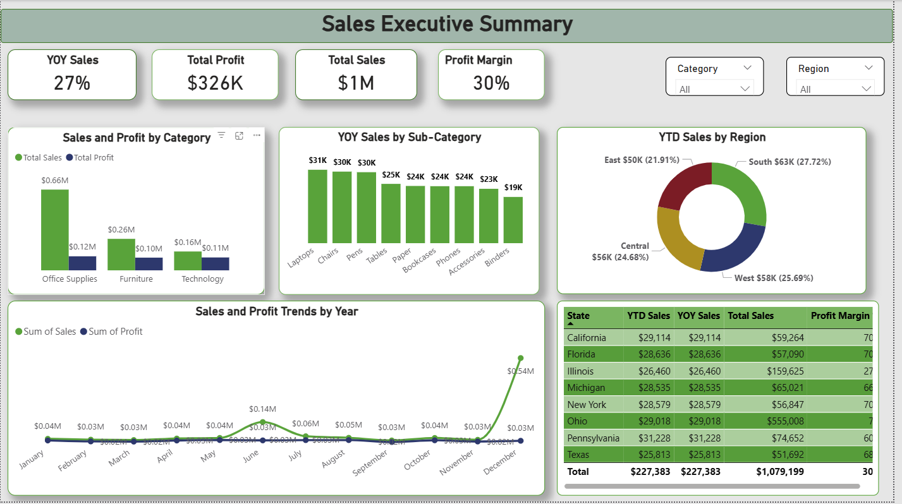

# GlobalMart Sales Analysis

## Problem Statement 
GlobalMart is a fictional multinational retail company operating across multiple regions and offering a diverse range of products, including Furniture, Office Supplies, and Technology. Despite its broad market presence, GlobalMart faces the ongoing challenge of optimizing sales performance and improving overall profitability. To remain competitive and support strategic decision-making, the company seeks to leverage data-driven insights to better understand regional performance, product trends, and profitability drivers.

## Objectives
1. Which products generate highest revenue and profit? 
2. Which categories contribute most to revenue? 
3. What are the profit margins? 
4. What is the product performance across the states and regions? 
5. What is the profitability trend over me? 

## Data Understanding 
The data set provided was an Excel workbook which contained 12 columns and 1011 rows.  
The columns are detailed below: 

- Order ID: Unique iden fier for each order 
- Order Date: Date the order was placed 
- Ship Date: Date the order was shipped 
- Region: Geographical region (e.g., East, West, Central, South) 
- State: State within the region 
- Category: Product category (e.g., Furniture, Office Supplies, Technology) 
- Sub-Category: Sub-category of the product (e.g., Chairs, Binders, Phones) 
- Product Name: Name of the product 
- Sales: Revenue generated from the sale 
- Quantity: Number of units sold 
- Discount: Discount applied (in percentage) 
- Profit: Profit earned from the sale

## Analysis

## Key Insights
1. Strong Overall Performance with Healthy Profitability

- Total Sales reached $1M with a 30% profit margin, indicating efficient cost management alongside revenue growth.

- Year-over-Year (YoY) Sales grew by 27%, showing strong business momentum and successful sales strategies.

Action: Maintain current pricing and cost controls while exploring selective price optimization in high-margin categories.

2. Office Supplies Is the Revenue & Profit Engine

- Office Supplies leads all categories with approximately $0.66M in sales and the highest profit contribution ($0.12M).

- Furniture and Technology contribute less and show comparatively lower profit efficiency.

Action:
✔ Prioritize inventory availability, promotions, and upselling within Office Supplies.
✔ Review pricing and supplier costs in Furniture and Technology to improve margins.

3. Regional Sales Are Well Balanced, with South Leading

- The South region leads YTD sales (27.7%), followed closely by West and Central regions.

- No single region dominates excessively, indicating diversified geographic risk.

Action:
✔ Replicate South region sales strategies in East and Central regions.
✔ Use regional performance benchmarks to guide sales targets and incentives.
